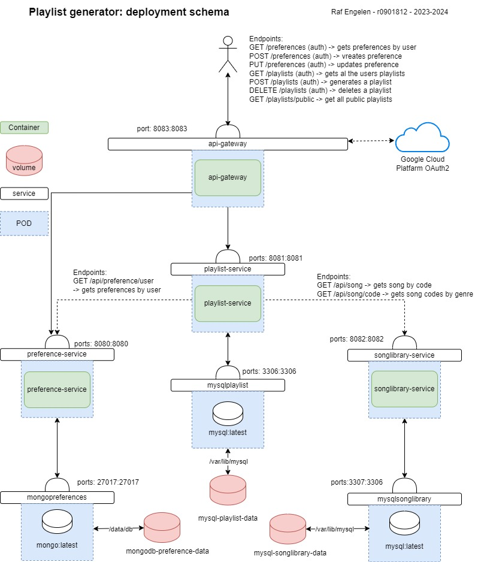

# Project EDE: playlist generator

## Thema
Het thema van dit project is om een backend te maken voor een playlist generator. Het doel is dus om een programma te maken dat na enige input een lijst kan maken van muziek die voldoen aan je voorkeuren. 
De reden dat ik dit thema gekozen heb is grotendeels toeval. Voor we de opdracht van dit project hadden gekregen was ik bezig met het maken van een afspeellijst voor mij persoonlijk. Dat gaf mij het idee om mijn project hierrond te maken. 

## Deployment schema en componenten

Componenten van de applicatie:
| Component | Uitleg |
| --------------- | --------------- |
| Mongopreferences    | Mongodb waar informatie over de voorkeuren van gebruikers worden bijgehouden. |
| Mysqlplaylist    |Mysql database waar playlists van gebruikers worden bijgehouden gelinkt aan de liedjes met behulp van de “code” attribute.|
| mysqlsonglibrary    |Mysql database met liedjes.|
| Preference-service    |Microservice waar de preference api zich in bevindt. Requests sturen naar deze api om de voorkeuren op te stellen, verwijderen, aan te passen of te lezen.|
| Songlibrary-service    |Microservice waar de songlibrary api zich in bevindt. Requests sturen naar deze api om liedjes op te halen.|
| Playlist-service   | Microservice waar de playlist api zich in bevindt. Requests sturen naar deze api om playlists te laten genereren, verwijderen of te lezen. De microservice maakt ook gebruik van de andere microservices. Door de preferences op te halen van gebruikers om daarna met die preferences liedjes op te halen.|
| Api-gateway   |Microservice die het verkeer regelt van buitenaf naar de applicatie. Ook gebruiken we deze gateway als een Oauth2 resource server. Zo zijn de api endpoints naar buitenaf beveiligd.|

