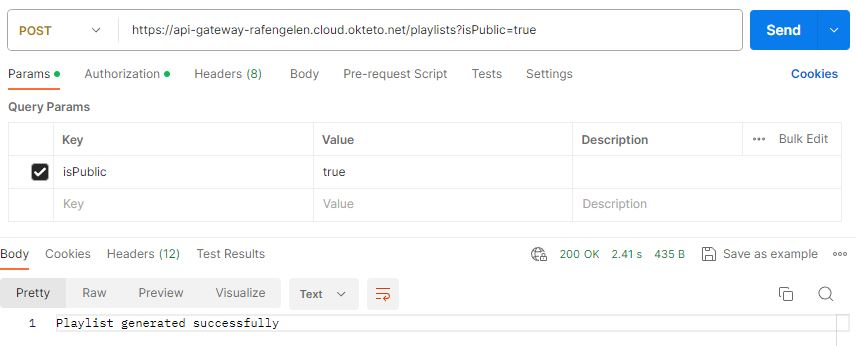

# Project EDE: playlist generator

## Thema
Het thema van dit project is om een backend te maken voor een playlist generator. Het doel is dus om een programma te maken dat na enige input een lijst kan maken van muziek die voldoen aan je voorkeuren. 
De reden dat ik dit thema gekozen heb is grotendeels toeval. Voor we de opdracht van dit project hadden gekregen was ik bezig met het maken van een afspeellijst voor mij persoonlijk. Dat gaf mij het idee om mijn project hierrond te maken. 

## Deployment schema en componenten

Componenten van de applicatie:
| Component | Uitleg |
| --------------- | --------------- |
| Mongopreferences    | Mongodb waar informatie over de voorkeuren van gebruikers worden bijgehouden. |
| Mysqlplaylist    |Mysql database waar playlists van gebruikers worden bijgehouden gelinkt aan de liedjes met behulp van de “code” attribute.|
| mysqlsonglibrary    |Mysql database met liedjes.|
| Preference-service    |Microservice waar de preference api zich in bevindt. Requests sturen naar deze api om de voorkeuren op te stellen, verwijderen, aan te passen of te lezen.|
| Songlibrary-service    |Microservice waar de songlibrary api zich in bevindt. Requests sturen naar deze api om liedjes op te halen.|
| Playlist-service   | Microservice waar de playlist api zich in bevindt. Requests sturen naar deze api om playlists te laten genereren, verwijderen of te lezen. De microservice maakt ook gebruik van de andere microservices. Door de preferences op te halen van gebruikers om daarna met die preferences liedjes op te halen.|
| Api-gateway   |Microservice die het verkeer regelt van buitenaf naar de applicatie. Ook gebruiken we deze gateway als een Oauth2 resource server. Zo zijn de api endpoints naar buitenaf beveiligd.|

## API endpoints
### Preference service

| request | Uitleg |
| --------------- | --------------- |
|POST (gateway)/preferences?name= (AUTH)|Er wordt een nieuwe preference aangemaakt. De naam wordt uit de parameters gehaald en de user wordt gehaald uit de bearer token.|

| request | Uitleg |
| --------------- | --------------- |
|GET (gateway)/preferences (AUTH)|Alle preferences worden opgehaald van de user. De user wordt nagekeken via de bearer token. |

| request | Uitleg |
| --------------- | --------------- |
|PUT (gateway)/preferences?code= (AUTH)|Bestaande preference met code die uit de parameters wordt gehaald. Wordt vervangen door de meegestuurde body. De id van gebruiker in de preference moet dezelfde zijn als degene in de bearer token.|

| request | Uitleg |
| --------------- | --------------- |
|GET (preference-service)/api/preference/user?userId=|Alle preferences van een gebruiker worden opgehaald. De userId komt vanuit de parameters. Deze api call is enkel voor intern gebruik en wordt gebruikt door de api-gateway.|

### Songlibrary service

| request | Uitleg |
| --------------- | --------------- |
|GET (songlibrary-service)/api/song/code?genre=|De codes van liedjes van het meegegeven genre worden opgehaald. Deze api call is enkel voor intern gebruik en wordt gebruikt door de api-gateway tijdens het genereren van een playlist.|

| request | Uitleg |
| --------------- | --------------- |
GET (songlibrary-service)/api/song?code=|Liedje met een bepaalde code wordt opgehaald. Deze api call is enkel voor intern gebruik en wordt gebruikt door de api-gateway tijdens het lezen van een playlist.|

### Playlist service

| request | Uitleg |
| --------------- | --------------- |
POST (gateway)/playlists?isPublic= (AUTH)|Genereert een playlist waarvan isPublic uit de parameters wordt gehaald en de userId uit de bearer token. Bij het oproepen van de bijhorende methode in de service zullen er api calls worden gemaakt naar de preference-service en naar de songlibrary-service.|

| request | Uitleg |
| --------------- | --------------- |
|GET (gateway)/playlists (AUTH)|Haalt alle playlists op van een gebruiker. De userId wordt uit de bearer token gehaald.|

| request | Uitleg |
| --------------- | --------------- |
|GET (gateway)/playlists/public|Alle playlists worden opgehaald waarbij isPublic waar is. Dit kan worden uitgevoerd zonder bearer token. Bij het oproepen van de bijhorende methode in de service zullen er api calls worden gemaakt naar de preference-service en naar de songlibrary-service.|

| request | Uitleg |
| --------------- | --------------- |
|DELETE (gateway)/playlists?code= (AUTH)|Verwijderd een playlist met code vanuit de parameters. Er wordt nagekeken of de userId vanuit de bearer token dezelfde is als die van de playlist.|

## Deployment
De online versie van deze applicatie wordt gehost op okteto onder de namespace “rafengelen”. Hier zijn de links naar de containers:

| Container | Link |
| --------------- | --------------- |
| Api-gateway    | https://api-gateway-rafengelen.cloud.okteto.net |
| Preference-service    |https://preference-service-rafengelen.cloud.okteto.net|
| Songlibrary-service    |https://songlibrary-service-rafengelen.cloud.okteto.net|
| Playlist-service    |https://playlist-service-rafengelen.cloud.okteto.net|

## Besluit

Volgens de minimum requerements moet ik minstens 3 GET, 1 POST, 1 PUT en 1 DELETE endpoints hebben op de gateway. Aan deze requirement voldoet mijn project zeker. Verder heb ik gebruik gemaakt van 2 keer een SQL database en 1 keer een mongodb database. Vervolgens lijken mijn paths vrij logisch, vaak wordt er bij een POST request een volledige body meegegeven, dit is bij mij niet altijd het geval (bij bijvoorbeeld POST /playlists) omdat het merendeel van de data gegenereerd wordt door de applicatie. Daardoor moet er enkel maar worden meegegeven of een playlist publiek moet zijn.